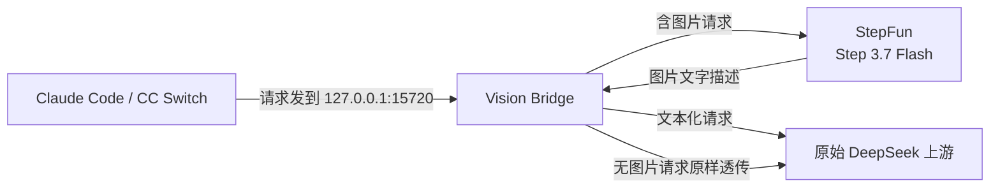

<p align="center">
  
  <a href="LICENSE"></a>
  
</p>

<h1 align="center">Claude DeepSeek Vision Bridge</h1>

<p align="center">
  让使用纯文本 DeepSeek 的 Claude Code，也能直接识别粘贴图片、截图和本地图片。
</p>

<p align="center">
  <a href="#快速开始">快速开始</a> ·
  <a href="#给其他-ai-的一键安装指令">交给 AI 安装</a> ·
  <a href="#安全边界">安全边界</a> ·
  <a href="#故障排查">故障排查</a>
</p>

> 这是一个运行在本机的翻译层：它把请求中的图片交给视觉模型生成文字描述，再把文本化请求转发给原始 DeepSeek 上游。它不修改 DeepSeek 的模型能力，也不要求 CC Switch 把纯文本模型伪装成多模态模型。

## 它解决什么问题

当 CC Switch 将 Claude Code 路由到只接受文本的 DeepSeek 上游时，粘贴图片通常会导致请求被上游拒绝。这个桥只处理含图片的请求；无图片请求继续原样透传。

| 使用场景 | 入口 | 处理方式 |
| --- | --- | --- |
| Claude Code 直接粘贴图片或截图 | `vision-bridge.js` | 图片先由 StepFun Vision 描述，再转成文本发给 DeepSeek |
| Agent 已拿到本地图片路径或远程 URL | `vision.js` + Vision Skill | 手动调用视觉 API，返回文字描述 |
| Word、Excel 等文档 | Claude Code 对应内置 Skill | 继续走文档 Skill，不会被本桥改成 OCR 流程 |



## 快速开始

需要：Windows、Node.js 18+、Claude Code，以及一个可以访问的 DeepSeek 文本上游地址。

1. 准备 StepFun 的视觉 API Key 和原始 DeepSeek 上游 Base URL。
2. 选择下面一种安装方式：让其他 AI 按 README 执行，或手动安装。
3. 启动桥并确认 `http://127.0.0.1:15720/health` 返回 `ok: true`。
4. 将 CC Switch 当前 DeepSeek 供应商的目标地址改为 `http://127.0.0.1:15720`，然后在 Claude Code 中粘贴一张图片测试。

### 给其他 AI 的一键安装指令

不需要先下载仓库。把下面完整内容复制给 Claude Code、Codex 或其他能够访问 GitHub、执行命令和修改本机配置的 AI。尖括号中的内容只在私聊中替换；不要把真实 API Key 发到公开聊天、截图或 Git 仓库。

> **网络环境提醒：** 如果你所在的电脑已开启 Clash 代理，请注意下面的完整安装指令包含代理地址。使用者和 AI 都应先确认这句话是否适合当前电脑，避免误用他人的本地代理端口。

<details>
<summary>展开并复制完整安装指令</summary>

```text
请全局安装并配置 Claude DeepSeek Vision Bridge：
https://github.com/R-R6/claude-deepseek-vision-bridge

这台电脑可能已开启 Clash 代理，地址是 127.0.0.1:7897。先检查当前电脑是否确实能访问这个代理；只有确认地址可用且访问 GitHub、npm、pip 等外网资源失败时，才临时使用 http://127.0.0.1:7897 重试。不要假设其他电脑有这个代理，也不要把它写入持久化配置。

请先完整阅读这个仓库的 README，再执行安装。不要根据猜测修改配置。

我的目标：在 Claude Code 使用纯文本 DeepSeek 模型时，可以直接粘贴图片并识别；如果我提供本地图片路径或远程图片 URL，也可以调用全局 Vision Skill。

视觉服务配置：
- 模型：阶跃星辰 Step 3.7 Flash
- Model ID：step-3.7-flash
- Base URL：https://api.stepfun.com/v1
- API Key：我已在本机用户级环境变量 `VISION_API_KEY` 中配置（只能检查是否存在，不得读取或回显）

文本模型路由：
- 我使用 CC Switch 管理 Claude Code 路由。
- 原始 DeepSeek 上游 Base URL：<修改 CC Switch 前的真实上游地址>
- Vision Bridge 本地地址：http://127.0.0.1:15720

请按下面顺序替我完成：
1. 检查 Node.js 18+、Claude Code、CC Switch、15720 端口和现有配置。
2. 备份 Claude Code 配置与 CC Switch 当前供应商配置；不要删除或覆盖无关配置。
3. 运行仓库提供的 Windows 安装脚本；它会把完整桥运行时、Vision Skill 和登录启动入口安装到对应目录，并备份同名旧文件。
4. 确认用户级环境变量 VISION_API_KEY、VISION_BASE_URL、VISION_MODEL、UPSTREAM 和 BRIDGE_PORT；如果 VISION_API_KEY 不存在，先向我询问缺少的值。不要把 API Key 写进源码、README、日志、CC Switch 备注或 Git。
5. 先运行仓库离线测试，再启动桥并检查 http://127.0.0.1:15720/health。健康响应必须包含 service=vision-bridge 和当前受管版本；若设置了 BRIDGE_AUTH_TOKEN，健康检查必须带 x-bridge-token 请求头。
6. 把 CC Switch 当前 DeepSeek 供应商的目标地址改为 http://127.0.0.1:15720；UPSTREAM 必须保留修改前的真实地址，防止形成循环代理。
7. 验证无图片文本请求、Claude Code 直接粘贴图片、本地图片路径三种场景。
8. 每一步展示实际命令结果和验证证据；失败时保留原配置并说明具体失败层，不要声称“已完成”却没有测试。
9. 全部通过后，让我立刻在 Claude Code 中粘贴一张图片做最终测试。

如果我没有提供真实 DeepSeek 上游地址或完整 API Key，请先只向我询问缺少的值，不要编造。API Key 已经在本机用户级环境变量中配置时，只检查是否存在，绝对不要回显它。
```

### `15720` 端口冲突时的处理规则

如果检查发现 `15720` 已被占用，先只读确认占用者，不要直接杀进程，也不要马上换端口：

```powershell
$listener = Get-NetTCPConnection -State Listen -LocalPort 15720 -ErrorAction SilentlyContinue
$listener | Select-Object LocalAddress, LocalPort, OwningProcess
$listener | ForEach-Object {
    Get-CimInstance Win32_Process -Filter "ProcessId=$($_.OwningProcess)" |
        Select-Object ProcessId, Name, ExecutablePath
}
$healthHeaders = @{}
if (-not [string]::IsNullOrWhiteSpace($env:BRIDGE_AUTH_TOKEN)) {
    $healthHeaders["x-bridge-token"] = $env:BRIDGE_AUTH_TOKEN
}
Invoke-RestMethod -Uri "http://127.0.0.1:15720/health" -Headers $healthHeaders |
    Select-Object ok, service, version
```

- 如果 `http://127.0.0.1:15720/health` 返回本项目受管版本的健康响应，说明是已经运行的桥；复用它，不要再启动第二个桥。
- 如果端口由其他程序、未知版本的桥或不健康进程占用，保留原状并向我报告 PID、进程名和可执行文件路径；不要停止未知进程。
- 只有在确认占用者是本项目旧桥并得到明确授权后，才可以停止旧桥，再重新运行启动器。启动器本身也会拒绝接管不健康的占用端口。
- 如果必须换端口，先确认一个未占用端口，例如 `15730`，然后同时修改用户级 `BRIDGE_PORT` 和 CC Switch 当前供应商目标：

```powershell
[Environment]::SetEnvironmentVariable("BRIDGE_PORT", "15730", "User")
```

```text
CC Switch 目标地址： http://127.0.0.1:15730
UPSTREAM：          原始 DeepSeek 上游地址（不要改成桥地址）
```

换端口后必须重新打开启动器继承环境变量的进程、重启 CC Switch 和 Claude Code，并检查对应端口的 `/health`。不要只改其中一处，否则会出现网关连接错误。

</details>

这段指令不会替 AI 猜测缺失的上游地址，也不会要求把密钥写入仓库。更安全的做法是先在本机设置 `VISION_API_KEY`，然后让 AI 只检查“是否已配置”。

## Windows 登录后自动启动

桥通过当前用户的 Windows Startup 文件夹在**登录后**启动，不是系统服务，也不会在登录前运行。安装仓库后执行：

```powershell
powershell.exe -NoLogo -NoProfile -ExecutionPolicy Bypass -File .\src\install-vision-bridge.ps1
```

安装器会先验证并暂存全部源文件，再备份已有的桥文件、Vision Skill 和 `vision-bridge.vbs`，最后替换 Startup 入口。如果检测到当前用户注册表中名为 `CC Switch` 的标准登录启动项，安装器还会把这条启动命令包在桥健康检查之后；原始命令保存在 `%USERPROFILE%\.claude\bridge\cc-switch-startup.command`，备份清单位于 `%USERPROFILE%\.claude\bridge\backups\install-*\manifest.json`。它不会设置环境变量、读取或写入 API Key，也不会修改 CC Switch 数据库、供应商或路由。

安装完成后，启动器会检查当前进程环境中的 `UPSTREAM` 和 `VISION_API_KEY`，验证端口上是否是本项目的受管版本，并在启动后轮询 `/health`。缺少配置、端口被其他程序占用或桥进程启动失败时，错误会写入 `%USERPROFILE%\.claude\bridge\vision-bridge.err.log`。如果桥未健康，CC Switch 协调器不会启动 CC Switch，避免它先启动并产生 502/503；详情写入 `%USERPROFILE%\.claude\bridge\cc-switch-startup.log`。

设置用户级环境变量后，要退出并重新登录 Windows，或至少重新打开 Explorer、终端、CC Switch 和 Claude Code，使 Startup 启动器实际继承到这些变量。启动器不会从旧 PowerShell 会话或 CC Switch 数据库猜测 `UPSTREAM`。

查看重启后的分层状态：

```powershell
powershell.exe -NoLogo -NoProfile -ExecutionPolicy Bypass -File "$env:USERPROFILE\.claude\bridge\diagnose-vision-bridge.ps1"
```

如需卸载，只删除 Startup 中的 `vision-bridge.vbs` 和本项目安装的脚本/Skill；如果安装器接管过 CC Switch 登录启动项，先运行 `powershell.exe -NoLogo -NoProfile -ExecutionPolicy Bypass -File "$env:USERPROFILE\.claude\bridge\restore-ccswitch-startup.ps1"` 恢复原始命令。不要删除 `cc-switch-startup.command` 或 `backups`，直到确认原始 CC Switch 启动项已经恢复。要回滚桥文件，按照备份目录的 `manifest.json` 将对应文件恢复后，再启动原来的桥。

## 与 CC Switch 一起工作

使用 CC Switch 本地代理时，实际链路是：

```text
Claude Code / Claude Desktop
  -> CC Switch 127.0.0.1:15721
  -> 当前 app 类型和供应商的目标地址 127.0.0.1:15720
  -> UPSTREAM 中保存的真实文本上游
```

`15721` 是 CC Switch 代理，`15720` 才是本项目的桥。Claude Code 和 Claude Desktop 可能使用不同的 app 类型/供应商配置；请在 CC Switch 界面分别确认实际使用的配置，而不是只改一个看起来相同的供应商。目标地址优先使用 `http://127.0.0.1:15720`，不要写成 `localhost`，因为桥默认只绑定 IPv4 loopback。

CC Switch 自身是否随 Windows 登录启动仍是用户设置。安装器只会包装已经存在的名为 `CC Switch` 的登录启动命令，不会创建 CC Switch 启动项，也不会修改 CC Switch 的登录开关。如果 `15720` 健康但 `15721` 没有监听，检查 `cc-switch-startup.log`，确认桥健康后再手动启动 CC Switch；若两端口都正常但请求没有进入桥，检查当前 app 类型、活动供应商目标地址和 CC Switch 的媒体降级设置。

本项目不在启动时自动编辑 CC Switch 的 SQLite 数据库，也不改供应商、模型映射或路由。它只在安装阶段包装 Windows 注册表中已经存在的 CC Switch 登录启动命令；需要调整路由时先用 CC Switch 界面，并先备份其配置。

## 手动安装（Windows）

### 1. 安装文件

```powershell
git clone https://github.com/R-R6/claude-deepseek-vision-bridge.git
Set-Location .\claude-deepseek-vision-bridge

powershell.exe -NoLogo -NoProfile -ExecutionPolicy Bypass -File .\src\install-vision-bridge.ps1
```

安装器不会替你填写 `UPSTREAM` 或任何密钥；先按下一节设置环境变量，再启动并检查桥。

### 2. 配置环境变量

下面的变量写入当前 Windows 用户，不会进入 Git。`UPSTREAM` 必须填写改路由前的真实 DeepSeek 上游地址；不要把它写成桥自己的地址。仓库里的 `.env.example` 只是配置参考，本项目不会自动加载 `.env` 文件。

```powershell
[Environment]::SetEnvironmentVariable("VISION_API_KEY", "<StepFun API Key>", "User")
[Environment]::SetEnvironmentVariable("VISION_BASE_URL", "https://api.stepfun.com/v1", "User")
[Environment]::SetEnvironmentVariable("VISION_MODEL", "step-3.7-flash", "User")
[Environment]::SetEnvironmentVariable("UPSTREAM", "<原始 DeepSeek 供应商 Base URL>", "User")
[Environment]::SetEnvironmentVariable("BRIDGE_HOST", "127.0.0.1", "User")
[Environment]::SetEnvironmentVariable("BRIDGE_PORT", "15720", "User")
```

设置后完全退出并重新打开终端、CC Switch 和 Claude Code，使它们继承新的用户环境变量。然后启动并检查桥：

```powershell
& "$env:USERPROFILE\.claude\bridge\start-vision-bridge.ps1"

$healthHeaders = @{}
if ($env:BRIDGE_AUTH_TOKEN) {
    $healthHeaders["x-bridge-token"] = $env:BRIDGE_AUTH_TOKEN
}
Invoke-RestMethod -Uri "http://127.0.0.1:15720/health" -Headers $healthHeaders
```

如果 PowerShell 因执行策略阻止脚本，可先解除这个刚下载文件的标记，再重试：

```powershell
Unblock-File -LiteralPath "$env:USERPROFILE\.claude\bridge\start-vision-bridge.ps1"
```

正常结果应包含：

```text
ok      service       version
--      -------       -------
True    vision-bridge 0.2.1
```

### 3. 修改 CC Switch 路由

只修改当前 DeepSeek 供应商的目标地址：

```text
目标地址：  http://127.0.0.1:15720
UPSTREAM：  修改前的真实 DeepSeek Base URL
```

不要把 `UPSTREAM` 也改成本地桥地址，否则会形成自代理循环。修改后重启 Claude Code，并先测试一条无图片文本请求，再直接粘贴图片。

## 手动识图

当 Agent 已经拿到图片路径或 URL，而不是 Claude Code 的原始粘贴请求时，可以直接调用后备入口：

```powershell
node "$env:USERPROFILE\.claude\skills\vision\vision.js" "C:\Temp\screen.png" "请读取图片中的关键文字"
node "$env:USERPROFILE\.claude\skills\vision\vision.js" --url "https://example.com/image.png" "请描述这张图"
```

## 配置参考

### 必要配置

| 变量 | 默认值 | 说明 |
| --- | --- | --- |
| `VISION_API_KEY` | 无 | StepFun 或兼容视觉服务的 API Key；必须通过环境变量提供 |
| `VISION_BASE_URL` | `https://api.stepfun.com/v1` | 视觉服务 Base URL |
| `VISION_MODEL` | `step-3.7-flash` | 视觉模型 ID |
| `UPSTREAM` | 无 | 原始 DeepSeek 文本上游 Base URL |
| `BRIDGE_HOST` | `127.0.0.1` | 监听地址；改为非 loopback 时必须启用认证 |
| `BRIDGE_PORT` | `15720` | 本地桥端口 |
| `BRIDGE_AUTH_TOKEN` | 空 | 可选桥令牌；请求头为 `x-bridge-token` |

### 资源和超时限制

默认值是保守的本机起点：一次请求最多 8 张图片、最多 2 个视觉 API 并发、最多 16 条含图任务。它们不会限制 Claude Code 对 Word、Excel 等文档 Skill 的处理。

| 变量 | 默认值 | 作用 |
| --- | ---: | --- |
| `BRIDGE_MAX_IMAGES` | `8` | 单次请求最多转换的图片数量 |
| `BRIDGE_MAX_CONCURRENT_VISION_REQUESTS` | `2` | 同时运行的视觉 API 请求数 |
| `BRIDGE_MAX_VISION_JOBS` | `16` | 可检查请求、运行中或排队中的含图任务总数；超出返回 `429` |
| `BRIDGE_MAX_BODY_BYTES` | `26214400` | 入站请求体上限，约 25 MiB |
| `VISION_TIMEOUT_MS` | `120000` | 单次视觉 API 调用超时 |
| `UPSTREAM_TIMEOUT_MS` | `120000` | 原始文本上游请求超时 |
| `BRIDGE_TOTAL_REQUEST_TIMEOUT_MS` | `300000` | 整条含图请求（转换和上游转发）的总超时 |
| `VISION_MAX_RESPONSE_BYTES` | `2097152` | 视觉服务响应体上限，约 2 MiB |
| `BRIDGE_HEADERS_TIMEOUT_MS` | `30000` | 入站请求头超时 |
| `BRIDGE_BODY_TIMEOUT_MS` | `120000` | 入站请求体超时 |
| `BRIDGE_KEEP_ALIVE_TIMEOUT_MS` | `5000` | HTTP Keep-Alive 超时 |
| `BRIDGE_STARTUP_TIMEOUT_MS` | `30000` | Windows 启动器等待受管 `/health` 通过的最长时间，范围 `1000`-`120000` |
| `BRIDGE_STARTUP_COORDINATOR_TIMEOUT_MS` | `120000` | CC Switch 登录启动协调器等待桥健康的最长时间；超时不启动 CC Switch，范围 `1000`-`300000` |
| `ALLOW_INSECURE_HTTP` | `0` | 仅显式设为 `1` 时允许远程 HTTP；不建议使用 |

## 支持范围

- Anthropic Messages：`image`，支持 base64 和 URL source。
- OpenAI Chat Completions：`image_url`。
- 无图片请求直接透传，保留查询参数和流式响应。
- `UPSTREAM` 可以是域名根地址，也可以包含 `/v1` 等基础路径。
- 不宣称支持 OpenAI Responses API 的 `input_image`。

## 安全边界

- 桥默认只监听 `127.0.0.1`。这适用于本机进程均可信的个人电脑。
- 如果将 `BRIDGE_HOST` 改为局域网或其他非 loopback 地址，必须设置 `BRIDGE_AUTH_TOKEN`；否则桥会拒绝启动。
- 共享电脑上建议启用令牌，并确认 CC Switch 支持注入 `x-bridge-token`。令牌会在转发到上游前删除。
- 图片会发送给 StepFun 或你配置的视觉服务。不要提交包含密码、令牌、私密代码或不应外传数据的截图。
- `VISION_BASE_URL` 和 `UPSTREAM` 默认要求 HTTPS；只有 loopback HTTP 可用于本地服务和测试。`ALLOW_INSECURE_HTTP=1` 会明文传输凭据和图片，仅用于你明确接受风险的场景。
- 日志保存在 `%USERPROFILE%\.claude\bridge\vision-bridge.log` 和 `vision-bridge.err.log`，桥不会主动记录 API Key 或图片 base64。

## 故障排查

| 现象 | 先检查 |
| --- | --- |
| 启动时报 `UPSTREAM is not configured` | 重新打开终端，确认用户级 `UPSTREAM` 指向原始 DeepSeek 地址 |
| `/health` 返回 `401` | 当前请求是否带有 `x-bridge-token`；本地测试可先使用 loopback 默认配置 |
| 粘贴图片仍返回 400 | CC Switch 目标是否为 `http://127.0.0.1:15720`；`UPSTREAM` 是否仍为真实上游；查看桥日志 |
| 返回 `413` | 请求体超过约 25 MiB，或单次图片数量超过 `BRIDGE_MAX_IMAGES` |
| 返回 `429` | 当前已有 16 条含图任务；稍后重试，或在确认费用和资源后调高 `BRIDGE_MAX_VISION_JOBS` |
| 本地图片路径无法识别 | 直接运行上面的 `vision.js` 命令，确认文件路径、API Key 和视觉服务 URL |
| Word/Excel 处理异常 | 这类任务应由 Claude Code 对应内置 Skill 处理，不是本桥的 OCR 入口 |
| 重启后出现 gateway connection error | 先运行 `diagnose-vision-bridge.ps1`：`15720` 不健康时修复 Startup/桥；`15721` 未监听时启动 CC Switch；两者都正常但请求绕过桥时检查当前 app 类型和供应商目标 |
| `15720` 端口被占用 | 先用 `Get-NetTCPConnection` 和 `Get-CimInstance Win32_Process` 确认 PID、进程路径，再请求健康检查；健康的受管桥直接复用，未知进程不要停止；换端口时同步修改 `BRIDGE_PORT` 和 CC Switch 目标 |

## 测试与开发

本项目无运行时依赖，要求 Node.js 18+。测试使用本地 mock 服务，不访问 StepFun，也不读取真实 API Key：

```powershell
npm.cmd run check
npm.cmd test
```

Smoke test 覆盖图片转换、无图透传、`/v1` 路径、查询参数、chunked framing、可选桥认证、图片数量上限、并发/排队、客户端断开、超时、HTTPS 校验和响应头过滤。Windows 启动脚本测试使用随机端口和临时带空格路径，覆盖认证健康检查、非桥占端口和启动超时，不触碰真实 `15720`/`15721`。

项目文件：

| 文件 | 用途 |
| --- | --- |
| `src/vision-bridge.js` | Claude Code/CC Switch 的本地透明桥 |
| `src/vision.js` | 本地图片路径或远程 URL 的手动识图入口 |
| `src/vision-client.js` | 两种入口共用的 OpenAI-compatible 视觉客户端 |
| `src/start-vision-bridge.ps1` | Windows 后台启动脚本 |
| `src/start-ccswitch-after-bridge.vbs` | 等待桥健康后再启动已存在的 CC Switch 登录命令 |
| `src/restore-ccswitch-startup.ps1` | 恢复安装器包装前的 CC Switch 登录命令 |
| `src/install-vision-bridge.ps1` | 暂存、备份并安装桥、Vision Skill 和 Startup 入口 |
| `src/diagnose-vision-bridge.ps1` | 只读检查桥、CC Switch 代理和 Claude Code 路由 |
| `src/SKILL.md.template` | 全局 Vision Skill 模板 |
| `test/bridge-smoke-test.js` | 无真实 API Key 的边界 smoke test |
| `test/startup-script-smoke-test.js` | Windows 启动器隔离 smoke test |

## 项目来源与许可证

本项目的“让纯文本模型调用另一视觉模型看图”这一工作流，受 [asuojun/claude-vision-skill](https://github.com/asuojun/claude-vision-skill) 启发，核对时参考的上游提交为 [`19ec87b`](https://github.com/asuojun/claude-vision-skill/commit/19ec87bd76053abe35cf94b42955b25062d65c7b)。

上游本地副本当时没有发现 LICENSE 文件，因此本仓库没有复制或再发布上游 `vision.js`。本仓库的视觉客户端、透明桥、启动脚本和测试均为独立实现；它不是上游项目的镜像、官方分支或官方产品。

本仓库代码采用 MIT 许可证，见 [LICENSE](LICENSE)。如果以后引入上游源码，应先确认上游最新许可证或取得作者授权。
