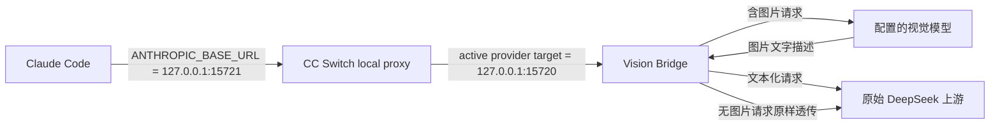

<p align="center">
  
  <a href="LICENSE"></a>
  
</p>

<h1 align="center">Claude DeepSeek Vision Bridge</h1>

<p align="center">
  让使用纯文本 DeepSeek 的 Claude Code，也能直接识别粘贴图片、截图和本地图片。
</p>

<p align="center">
  <a href="#快速开始">快速开始</a> ·
  <a href="#给其他-ai-的一键安装指令">交给 AI 安装</a> ·
  <a href="#更换文本-deepseek-上游">更换上游</a> ·
  <a href="#安全边界">安全边界</a> ·
  <a href="#故障排查">故障排查</a>
</p>

> 这是一个运行在本机的翻译层：它把请求中的图片交给视觉模型生成文字描述，再把文本化请求转发给原始 DeepSeek 上游。它不修改 DeepSeek 的模型能力，也不要求 CC Switch 把纯文本模型伪装成多模态模型。

## 它解决什么问题

当 CC Switch 将 Claude Code 路由到只接受文本的 DeepSeek 上游时，粘贴图片通常会导致请求被上游拒绝。这个桥只处理含图片的请求；无图片请求继续原样透传。

| 使用场景 | 入口 | 处理方式 |
| --- | --- | --- |
| Claude Code 直接粘贴图片或截图 | `vision-bridge.js` | 图片先由配置的视觉模型描述，再转成文本发给 DeepSeek |
| Agent 已拿到本地图片路径或远程 URL | `vision.js` + Vision Skill | 手动调用视觉 API，返回文字描述 |
| Word、Excel 等文档 | Claude Code 对应内置 Skill | 继续走文档 Skill，不会被本桥改成 OCR 流程 |



上图展示的是 **CC Switch 模式**。桥本身不负责 Anthropic Messages 与 OpenAI Chat Completions 之间的协议转换；它只负责图片转文字，并保留入口协议的路径与字段语义，把请求转发给 `UPSTREAM`。无图片请求会直接透传；含图片请求会在替换图片块后重新序列化。因此 `UPSTREAM` 必须直接接收桥转发的协议，或指向一个明确负责协议转换的适配器。

## 快速开始

需要：Windows、Node.js 18+、Git（如果使用 `git clone`）、Claude Code，以及一个能把 Claude Code 请求送到本桥的路由器、协议适配器或兼容上游。CC Switch 是已验证的推荐路由器，但不是桥的硬性依赖。

先选择路由模式：

| 模式 | 你需要提供 | 本项目负责 | 仍由使用者负责 |
| --- | --- | --- | --- |
| CC Switch 已配置 | 真实文本上游 Base URL、视觉模型三项 | 配置桥、安装 Skill、安装登录启动入口 | CC Switch 中的文本 Key、Model、目标地址和开机启动开关 |
| 其他路由器已配置 | 真实文本上游 Base URL、视觉模型三项 | 配置桥、安装 Skill、安装登录启动入口 | 让现有路由器把请求送到桥，并保留路由器中的文本 Key/Model |
| 直连桥 | 能接收 Claude Code Anthropic Messages 的文本上游，或提供 Anthropic-compatible 入口并负责后续转换的适配器地址、视觉模型三项，以及 Claude Code 使用的文本 Key/Model | 配置桥、安装 Skill、安装登录启动入口 | Claude Code 的桥地址、文本凭据和模型；桥不会把 Anthropic Messages 转换成 OpenAI，原生 OpenAI-only DeepSeek 地址不能直接作为直连桥的 `UPSTREAM` |

桥不会编辑 CC Switch SQLite、供应商、模型映射或未知路由器配置。无论哪种模式，先完成桥安装，再分别验证桥健康、路由链路和最终图片请求。

### 没有 CC Switch 时的协议边界

没有 CC Switch 也可以使用本项目，但必须先有能承接 Claude Code 请求的兼容上游、路由或协议适配器：

- 已有协议适配器暴露 Anthropic-compatible 入口时，链路是 `Claude Code -> Vision Bridge -> 适配器 -> DeepSeek`；桥保持 Anthropic Messages 的协议语义，适配器自己负责后续协议转换，把适配器的 Anthropic 入口写入 `UPSTREAM`。
- 已有路由器先把 Claude Code 请求转换成 OpenAI Chat Completions 时，链路是 `Claude Code -> 路由器 -> Vision Bridge -> DeepSeek`；路由器把转换后的请求送到桥端口，桥保持 OpenAI Chat Completions 的协议语义，把真实 OpenAI-compatible DeepSeek 地址写入 `UPSTREAM`。
- 不能把一个只接受 OpenAI Chat Completions 的原生 DeepSeek 地址直接放进“直连桥”模式，然后期待桥替你完成协议转换。此时应使用 CC Switch 或外部协议适配器。

### 给其他 AI 的一键安装指令

不需要先手动下载仓库。先把下面配置块中的路由模式和需要的字段替换为实际值，再把完整内容复制给 Claude Code、Codex 或其他能够访问 GitHub、执行命令和修改本机配置的 AI。不要把真实 API Key 发到公开聊天、截图或 Git 仓库。

> **网络环境提醒：** 如果你所在的电脑已开启 Clash 代理，请注意下面的完整安装指令包含代理地址。使用者和 AI 都应先确认这句话是否适合当前电脑，避免误用他人的本地代理端口。

<details>
<summary>展开并复制完整安装指令</summary>

```text
请在这台 Windows 电脑的当前用户范围内全局安装并配置 Claude DeepSeek Vision Bridge（不是 npm 全局包，也不是系统级安装）：
https://github.com/R-R6/claude-deepseek-vision-bridge

这台电脑可能已开启 Clash 代理，地址是 127.0.0.1:7897。先检查当前电脑是否确实能访问这个代理；只有确认地址可用且访问 GitHub、npm、pip 等外网资源失败时，才临时使用 http://127.0.0.1:7897 重试。不要假设其他电脑有这个代理，也不要把它写入持久化配置。

如果确实需要代理，给当前下载/测试命令临时设置 `HTTP_PROXY` 和 `HTTPS_PROXY` 即可；不要写入 Windows 用户环境变量、仓库文件、CC Switch 配置或启动脚本。下载成功后清除当前进程中的代理变量，再继续本机桥配置。

请先完整阅读这个仓库的 README，再执行安装。不要根据猜测修改配置。
这是一次本机配置任务，不要修改仓库源码、不要执行 `npm install`、不要创建 `.env` 文件、不要提交或推送 Git 更改。
请把仓库克隆到一个新的工作目录；如果目标目录已经存在，先检查其远程地址和工作区状态，不要删除或覆盖其中的用户文件。

我的目标：在 Claude Code 使用纯文本 DeepSeek 模型时，可以直接粘贴图片并识别；如果我提供本地图片路径或远程图片 URL，也可以调用全局 Vision Skill。

路由模式（只选择一项）：
- <CC Switch 已配置 / 其他路由器已配置 / 直连桥>

本次安装使用以下配置。请按字段使用这些值，不要猜测、替换或要求我重复提供：

纯文本 DeepSeek 模型：
- Base URL: <真实文本模型 Base URL>
- API Key: <文本模型 API Key；如果路由模式为 CC Switch 已配置，填写“已在 CC Switch 中配置”>
- Model: <文本模型 ID；如果路由模式为 CC Switch 已配置，填写“已在 CC Switch 中配置”>

视觉模型：
- Base URL: <真实视觉模型 Base URL>
- API Key: <视觉模型 API Key>
- Model: <视觉模型 ID>

配置映射：
- 纯文本模型 Base URL 写入当前用户环境变量 `UPSTREAM`；它是桥转发请求的真实上游地址，不是 CC Switch 的最终目标地址。
- 视觉模型 Base URL、API Key 和 Model 分别写入 `VISION_BASE_URL`、`VISION_API_KEY`、`VISION_MODEL`。
- 纯文本 API Key 和 Model 不由桥保存或推断：CC Switch 模式由我在 CC Switch 中维护，其他路由器模式由我在现有路由器中维护，直连桥模式由我在 Claude Code/协议适配器中维护。
- 如果路由模式为 CC Switch 已配置，不要修改 CC Switch 的文本 Key、Model、供应商、路由或数据库；安装完成后提醒我由自己把当前活动供应商的目标地址确认或修改为 `http://127.0.0.1:15720`，并保留 Claude Code 到 CC Switch 的 `http://127.0.0.1:15721`。
- 如果路由模式为其他路由器已配置，不要猜测或修改未知路由器；使用 `-SkipCCSwitch -ExpectedRoutePort <现有路由器端口>` 诊断，或在端口未知时使用 `-SkipRouteCheck`，并提醒我确认现有路由器实际指向 `BRIDGE_PORT`。
- 如果路由模式为直连桥，不要修改未知路由器；使用 `-SkipCCSwitch` 诊断，并提醒我确认 Claude Code 实际指向 `BRIDGE_PORT`。
- 写入或验证时不要在命令输出、日志、截图、源码、README、CC Switch 备注或 Git 中显示 API Key；只报告是否配置成功。

请按下面顺序替我完成：
1. 先检查 `node --version`、`git --version`、Claude Code、当前路由器和用户级环境变量。只有 CC Switch 模式才检查 `15721`；其他模式不要因为没有 CC Switch 而失败。API Key 只能检查是否存在，不能读取或回显。
2. 按所选模式检查必需字段：CC Switch/其他路由器模式至少需要真实文本 Base URL 和视觉三项；直连桥模式还必须确认 Claude Code 或协议适配器已有文本 Key/Model。CC Switch 模式下文本 API Key/Model 可以是“已在 CC Switch 中配置”，不得要求重复提供。确认视觉服务兼容 OpenAI Chat Completions，以及 `UPSTREAM` 能接收桥转发的请求格式。缺少字段或格式不正确时，只报告具体缺项并暂停，不要猜测。
3. 只安装仓库提供的桥、Vision Skill 和 Windows 登录入口。不要编辑 CC Switch SQLite、供应商、模型映射、路由或任何未知路由器配置；这些由我自己完成或确认。
4. 如果是 CC Switch 模式，检查它的开机启动是否已由我开启；如果没有标准登录启动项，只报告，不要替我创建或接管其他启动方式。其他模式跳过 CC Switch 检查。
5. 按“配置映射”写入视觉模型的三个用户级环境变量和纯文本模型的 `UPSTREAM`。不要把真实文本 Base URL 写成 CC Switch/路由器的最终桥目标，也不要把桥地址写进 `UPSTREAM`。
6. 如果刚用 `[Environment]::SetEnvironmentVariable(..., "User")` 写入变量，先完成安装再运行已安装的 `restart-vision-bridge.ps1`；它默认使用 `-EnvironmentScope User`，不要把 API Key 放入命令行。该脚本只会停止经过命令行、路径、所有者和启动时间二次确认的本项目旧桥。若这是早于回滚快照功能的旧安装且提示没有受保护快照，只有在确认当前用户环境仍是现有桥配置时，才追加 `-BootstrapRollbackState` 进行一次迁移；如果配置刚改过但旧进程尚未加载，先重启 Windows，不要强行迁移。
7. 从仓库根目录运行 `npm.cmd run check` 和 `npm.cmd test`，再运行仓库提供的 Windows 安装脚本。CC Switch 模式使用默认安装命令；其他路由器/直连桥模式必须追加 `-SkipCCSwitchStartupCoordination`，即使电脑上安装了 CC Switch 也不要包装它的登录启动项。安装器会把桥运行时、全局 Vision Skill、重启脚本和登录启动入口安装到对应目录，并备份同名旧文件；它不会停止已有桥进程。
8. 安装完成后运行已安装的 `restart-vision-bridge.ps1`，让新用户级配置真正加载到桥进程；如果端口由未知进程或不健康桥占用，脚本会保留原状并失败，不要强行停止占用者。只有旧安装缺少回滚快照且当前用户环境确认未变化时，才使用 `-BootstrapRollbackState` 一次建立迁移快照。然后检查 `http://127.0.0.1:15720/health`，健康响应必须包含 `ok=true`、`service=vision-bridge` 和当前受管版本；若设置了 `BRIDGE_AUTH_TOKEN`，请求必须带 `x-bridge-token`。
9. CC Switch 模式提醒我自己把当前活动供应商目标确认或修改为 `http://127.0.0.1:15720`，并保留 Claude Code 到 CC Switch 的 `http://127.0.0.1:15721`；不要把文本真实上游继续作为最终目标。其他路由器模式提醒我自己确认现有路由器实际指向 `BRIDGE_PORT`；直连桥模式提醒我自己确认 Claude Code 指向 `BRIDGE_PORT`，且 `UPSTREAM` 是兼容 Claude Code 请求格式的上游或适配器。
10. 按当前模式运行诊断：CC Switch 模式使用默认诊断；其他路由器模式使用 `diagnose-vision-bridge.ps1 -SkipCCSwitch -ExpectedRoutePort <现有路由器端口>`，端口未知时使用 `-SkipRouteCheck`；直连桥模式使用 `-SkipCCSwitch`。确认桥和路由链路后，先验证无图片文本请求，再测试粘贴图片和需要时的本地图片路径 Vision Skill。
11. 让我完成最终粘贴图片测试；如果需要验证开机流程，先向我确认再重启 Windows。重启后登录并等待约 10-30 秒，再直接打开 Claude Code 验证无需手动命令即可识图；不要未经确认自动重启电脑。
12. 每一步展示实际命令结果和验证证据；失败时保留原配置并说明具体失败层，不要声称“已完成”却没有测试。

安装成功的硬性证据：
- `15720/health` 返回当前受管桥版本；
- CC Switch 模式：`15721` 正在监听、Claude Code 的 `ANTHROPIC_BASE_URL` 指向 `http://127.0.0.1:15721`、活动供应商目标指向 `http://127.0.0.1:15720`，并且 Windows `CC Switch` 登录启动项包含 `start-ccswitch-after-bridge.vbs`；
- 其他路由器模式：现有路由器已明确指向 `BRIDGE_PORT`，其文本 Key/Model 已配置，并且 `UPSTREAM` 是与桥收到的请求协议兼容的上游；
- 直连桥模式：Claude Code 已指向 `BRIDGE_PORT`，Claude Code/适配器已配置文本 Key/Model，且 `UPSTREAM` 是 Anthropic-compatible 上游或适配器；
- 重启 Windows 后无需手动启动桥或重新修改路由。

如果配置块中有任何必需字段缺失，请只报告缺少的字段，不要编造或从其他配置猜测。完成后只报告配置是否成功，不要回显任何 API Key。
```

如果 AI 遇到以下任一情况，应该暂停并报告，而不是猜测或强行覆盖：真实 `UPSTREAM` 不明、`15720`/`15721` 被未知进程占用、CC Switch 没有标准登录启动项、已配置 `BRIDGE_AUTH_TOKEN` 但 CC Switch 无法注入 `x-bridge-token`，或 CC Switch 更新后启动项指向了不存在的旧路径。AI 也不应为了“让测试通过”把 `UPSTREAM` 改成桥地址、关闭令牌、修改 `input_modalities` 或编辑 CC Switch 数据库。

### `15720` 端口冲突时的处理规则

如果检查发现 `15720` 已被占用，先只读确认占用者，不要直接杀进程，也不要马上换端口：

```powershell
$listener = Get-NetTCPConnection -State Listen -LocalPort 15720 -ErrorAction SilentlyContinue
$listener | Select-Object LocalAddress, LocalPort, OwningProcess
$listener | ForEach-Object {
    Get-CimInstance Win32_Process -Filter "ProcessId=$($_.OwningProcess)" |
        Select-Object ProcessId, Name, ExecutablePath
}
$healthHeaders = @{}
if (-not [string]::IsNullOrWhiteSpace($env:BRIDGE_AUTH_TOKEN)) {
    $healthHeaders["x-bridge-token"] = $env:BRIDGE_AUTH_TOKEN
}
Invoke-RestMethod -Uri "http://127.0.0.1:15720/health" -Headers $healthHeaders |
    Select-Object ok, service, version
```

- 如果 `http://127.0.0.1:15720/health` 返回本项目受管版本的健康响应，说明是已经运行的桥；复用它，不要再启动第二个桥。
- 如果端口由其他程序、未知版本的桥或不健康进程占用，保留原状并向我报告 PID、进程名和可执行文件路径；不要停止未知进程。
- 只有在确认占用者是本项目旧桥并得到明确授权后，才可以停止旧桥，再重新运行启动器。启动器本身也会拒绝接管不健康的占用端口。
- 如果必须换端口，先确认一个未占用端口，例如 `15730`，然后同时修改用户级 `BRIDGE_PORT` 和 CC Switch 当前供应商目标：

```powershell
[Environment]::SetEnvironmentVariable("BRIDGE_PORT", "15730", "User")
```

```text
CC Switch 目标地址： http://127.0.0.1:15730
UPSTREAM：          原始 DeepSeek 上游地址（不要改成桥地址）
```

换端口后必须重新打开启动器继承环境变量的进程、重启 CC Switch 和 Claude Code，并检查对应端口的 `/health`。不要只改其中一处，否则会出现网关连接错误。

如果是 `15721` 被占用，那个端口属于 CC Switch 本地代理，不要让桥改用 `15721`，也不要停止占用者。先确认 CC Switch 实际配置的代理端口，再在 Claude Code 的 `ANTHROPIC_BASE_URL`、诊断脚本参数和使用说明中统一该端口；桥的 `BRIDGE_PORT` 仍应与 CC Switch 的供应商目标端口分开。

</details>

这段指令会按所选路由模式配置桥，不会擅自接管 CC Switch 或其他路由器，也不会猜测缺失值或把配置写入仓库。

## Windows 登录后自动启动

桥通过当前用户的 Windows Startup 文件夹在登录后启动，不是系统服务。请在实际使用 Claude Code/CC Switch 的同一个 Windows 用户下运行安装器，不需要管理员权限：

```powershell
powershell.exe -NoLogo -NoProfile -ExecutionPolicy Bypass -File .\src\install-vision-bridge.ps1
```

安装器会备份并安装桥、Vision Skill 和 Startup 入口；如果已经存在名为 `CC Switch` 的标准用户登录启动项，还会让它等待桥健康后再启动。原始命令和备份保存在 `%USERPROFILE%\.claude\bridge` 下。安装器不会设置环境变量、读取 API Key、编辑 CC Switch 数据库或修改供应商路由。

启动器要求当前进程能看到 `UPSTREAM` 和 `VISION_API_KEY`，并会把错误写入 `%USERPROFILE%\.claude\bridge\vision-bridge.err.log`。设置用户级变量后，重新打开终端、CC Switch 和 Claude Code；要让 Windows 登录启动继承新值，重新登录或重启 Windows。

查看重启后的分层状态：

```powershell
powershell.exe -NoLogo -NoProfile -ExecutionPolicy Bypass -File "$env:USERPROFILE\.claude\bridge\diagnose-vision-bridge.ps1"
```

如需卸载，先用 `%USERPROFILE%\.claude\bridge\restore-ccswitch-startup.ps1` 恢复 CC Switch 原始启动命令，再删除本项目安装的桥、Skill 和 Startup 文件；确认恢复成功前保留 `cc-switch-startup.command` 与 `backups`。

## 与 CC Switch 一起工作

| 位置 | 地址或变量 | 配置位置 |
| --- | --- | --- |
| Claude Code -> CC Switch | `http://127.0.0.1:15721` | Claude Code 的 `ANTHROPIC_BASE_URL` |
| CC Switch -> Vision Bridge | `http://127.0.0.1:15720` | 当前活动供应商的目标地址 |
| Vision Bridge -> 文本上游 | `UPSTREAM` | 当前 Windows 用户环境变量 |
| Vision Skill -> 视觉服务 | `VISION_BASE_URL` | 当前 Windows 用户环境变量 |

Claude Code 和 Claude Desktop 可能使用不同的 CC Switch app 类型/供应商配置，请确认实际使用的那一项。不要把 `localhost`、`15720` 和 `15721` 的角色混用。

CC Switch 是否随 Windows 登录启动仍由其自身设置控制；安装器不会创建或修改这个开关。`15720` 健康但 `15721` 未监听时，检查 `cc-switch-startup.log`；两端口都正常但请求绕过桥时，检查当前 app 类型和活动供应商目标地址。

本项目不在启动时自动编辑 CC Switch 的 SQLite 数据库，也不改供应商、模型映射或路由。它只在安装阶段包装 Windows 注册表中已经存在的 CC Switch 登录启动命令；需要调整路由时先用 CC Switch 界面，并先备份其配置。

### 更换文本 DeepSeek 上游

桥不保存文本模型的 Base URL 或 API Key：`UPSTREAM` 保存真实上游地址，文本 API Key 由当前路由器、Claude Code 或协议适配器保存并随 `Authorization` 头发送。

| 要更换的内容 | 修改位置 | 修改后 |
| --- | --- | --- |
| 文本模型 Base URL | 当前用户的 `UPSTREAM` | 重新打开 PowerShell，重启桥、CC Switch 和 Claude Code |
| 文本模型 API Key | 当前模式的路由器、Claude Code 或协议适配器 | 在对应位置保存后重启承载它的客户端/路由器；不用重装桥 |

更换 Base URL 时：

```powershell
[Environment]::SetEnvironmentVariable(
  "UPSTREAM",
  "https://your-deepseek-provider.example/v1",
  "User"
)
```

把占位地址替换成自己的真实地址，例如 `https://tokenrhythm.studio/v1`。不要把 `UPSTREAM` 改成 `15720`，否则会形成自代理循环。修改 `UPSTREAM`、视觉配置或桥配置后，使用已安装的重启脚本重新加载用户级环境变量：

```powershell
powershell.exe -NoLogo -NoProfile -ExecutionPolicy Bypass `
  -File "$env:USERPROFILE\.claude\bridge\restart-vision-bridge.ps1"
```

该脚本只会停止经过路径、命令行、当前用户和启动时间二次确认的本项目旧桥，然后启动新桥并等待健康检查；它会造成短暂中断，不会停止未知的 `node.exe`。如果这是早于回滚快照功能的旧安装，先确认用户级环境仍对应当前运行桥，再使用：

```powershell
powershell.exe -NoLogo -NoProfile -ExecutionPolicy Bypass `
  -File "$env:USERPROFILE\.claude\bridge\restart-vision-bridge.ps1" `
  -BootstrapRollbackState
```

如果没有已安装的旧桥，或当前配置刚刚变化但旧桥尚未加载，也可以重启 Windows，让登录启动入口读取新配置。

按当前模式替换文本 API Key：CC Switch 模式改当前活动供应商，其他路由器模式改现有路由器，直连桥模式改 Claude Code 或协议适配器。不要把它写进 `UPSTREAM`、README、`.env`、命令行或 Git；CC Switch/其他路由器的目标地址仍应是 `http://127.0.0.1:15720`，直连桥模式的 `ANTHROPIC_BASE_URL` 也应指向桥，否则图片请求会绕过桥。修改后先测试文本请求，再测试粘贴图片。

新电脑首次安装时，CC Switch 模式建议先在 CC Switch 中配置并验证真实文本上游，再安装桥并把当前供应商目标改为 `15720`。其他路由器/直连模式可以不安装 CC Switch，但必须先准备兼容的路由或协议适配器。桥不会创建供应商、保存文本 API Key 或编辑 CC Switch 数据库；没有可用路由时只能完成桥文件安装，不能完成最终链路测试。

### CC Switch 更新后的检查

更新 CC Switch 后先运行 `diagnose-vision-bridge.ps1`。如果登录启动项不再包含桥协调器，或其保存的程序路径已不存在：在 CC Switch 中关闭再开启开机启动，完全退出并重新打开 CC Switch，再重新运行安装器。不要猜写 `cc-switch.exe` 路径或编辑 SQLite；恢复安装前的启动项可运行 `%USERPROFILE%\.claude\bridge\restore-ccswitch-startup.ps1`。

## 手动安装（Windows）

### 1. 下载文件

```powershell
git clone https://github.com/R-R6/claude-deepseek-vision-bridge.git
Set-Location .\claude-deepseek-vision-bridge
```

如果没有 Git，可以下载 GitHub 的 ZIP 到新的工作目录并解压；不要为了本项目执行 `npm install`，项目没有运行时依赖。不要在已有用户工作目录中直接解压覆盖文件。

### 2. 配置环境变量

下面的变量写入当前 Windows 用户，不会进入 Git。这里的值应来自一键安装指令中的“视觉模型”配置和“纯文本 DeepSeek 模型”的 Base URL；尖括号不能原样执行。`UPSTREAM` 必须填写真实文本上游地址；不要把它写成桥自己的地址。文本 API Key 和 Model 由当前模式的 CC Switch、其他路由器、Claude Code 或协议适配器维护，桥不会替你写入。仓库里的 `.env.example` 只是配置参考，本项目不会自动加载 `.env` 文件。

```powershell
[Environment]::SetEnvironmentVariable("VISION_BASE_URL", "<视觉模型 Base URL>", "User")
[Environment]::SetEnvironmentVariable("VISION_MODEL", "<视觉模型 ID>", "User")
[Environment]::SetEnvironmentVariable("UPSTREAM", "<原始 DeepSeek 供应商 Base URL>", "User")
[Environment]::SetEnvironmentVariable("BRIDGE_HOST", "127.0.0.1", "User")
[Environment]::SetEnvironmentVariable("BRIDGE_PORT", "15720", "User")
```

将“视觉模型”的 API Key 写入 `VISION_API_KEY`。如果需要在 PowerShell 中设置，使用不回显的安全输入，不要把真实 Key 写进命令文本：

```powershell
$secureKey = Read-Host "Vision model API key" -AsSecureString
$keyPtr = [Runtime.InteropServices.Marshal]::SecureStringToBSTR($secureKey)
try {
    $keyPlain = [Runtime.InteropServices.Marshal]::PtrToStringBSTR($keyPtr)
    [Environment]::SetEnvironmentVariable("VISION_API_KEY", $keyPlain, "User")
} finally {
    if ($keyPtr -ne [IntPtr]::Zero) {
        [Runtime.InteropServices.Marshal]::ZeroFreeBSTR($keyPtr)
    }
    $keyPlain = $null
    $secureKey = $null
}
```

如果只缺少非敏感变量，可以按上面的配置值设置；如果缺少视觉 API Key 或真实文本上游，先取得正确值，不要编造。然后先运行离线检查：

只检查用户级变量是否存在时，使用不会回显值的方式：

```powershell
foreach ($name in @("VISION_API_KEY", "VISION_BASE_URL", "VISION_MODEL", "UPSTREAM", "BRIDGE_HOST", "BRIDGE_PORT")) {
    $value = [Environment]::GetEnvironmentVariable($name, "User")
    "{0}={1}" -f $name, ($(if ([string]::IsNullOrWhiteSpace($value)) { "missing" } else { "present" }))
}
```

不要用 `Get-ChildItem Env:`、`$env:VISION_API_KEY` 或直接打印 `UPSTREAM` 来做这一步；它们可能把密钥或带凭据的 URL 写入终端记录。

```powershell
npm.cmd run check
npm.cmd test
```

### 3. 安装启动入口

确认环境变量已配置、当前 PowerShell 已刷新，并且离线检查已通过后，再运行安装器。CC Switch 模式使用：

```powershell
powershell.exe -NoLogo -NoProfile -ExecutionPolicy Bypass -File .\src\install-vision-bridge.ps1
```

其他路由器或直连桥模式使用：

```powershell
powershell.exe -NoLogo -NoProfile -ExecutionPolicy Bypass `
  -File .\src\install-vision-bridge.ps1 -SkipCCSwitchStartupCoordination
```

安装器会把桥、全局 Vision Skill 和 Windows 登录启动入口复制到当前用户目录，并备份已有文件。成功时应看到：

```text
Vision Bridge runtime and Vision Skill installed.
CC Switch startup now waits for the bridge health check
```

如果看到 `No recognizable CC Switch startup entry was found`，安装器没有接管 CC Switch 的启动顺序；先在 CC Switch 中开启开机启动，完全退出并重新打开，再重新运行安装器。

安装后完全退出并重新打开 PowerShell、CC Switch 和 Claude Code，使它们继承新的用户环境变量。然后使用已安装的重启脚本加载新配置并检查桥：

```powershell
powershell.exe -NoLogo -NoProfile -ExecutionPolicy Bypass `
  -File "$env:USERPROFILE\.claude\bridge\restart-vision-bridge.ps1"

$healthHeaders = @{}
if ($env:BRIDGE_AUTH_TOKEN) {
    $healthHeaders["x-bridge-token"] = $env:BRIDGE_AUTH_TOKEN
}
Invoke-RestMethod -Uri "http://127.0.0.1:15720/health" -Headers $healthHeaders
```

如果 PowerShell 因执行策略阻止脚本，可先解除这个刚下载文件的标记，再重试：

```powershell
Unblock-File -LiteralPath "$env:USERPROFILE\.claude\bridge\start-vision-bridge.ps1"
```

正常结果应包含：

```text
ok      service       version
--      -------       -------
True    vision-bridge 0.2.1
```

### 4. 配置路由器或 Claude Code

按当前模式完成对应配置。桥不会代替使用者编辑 CC Switch 或其他路由器：

**CC Switch 模式**：在当前实际使用的 app 类型和活动 DeepSeek 供应商中填写配置块里的：

```text
API Key：纯文本 DeepSeek 模型的 API Key
Model：   纯文本 DeepSeek 模型的 Model
目标地址：http://127.0.0.1:15720
```

不要把纯文本模型的真实 Base URL 继续作为 CC Switch 的目标；它已经写入 `UPSTREAM`，由桥转发。不要修改 `input_modalities` 或其他供应商。修改后完全重启 Claude Code，并先测试一条无图片文本请求，再直接粘贴图片。更换文本 Base URL 或 API Key 的方式见[上面的说明](#更换文本-deepseek-上游)。

**其他路由器模式**：让现有路由器的目标指向 `http://127.0.0.1:15720`，并保留它自己的文本 API Key/Model；使用 `diagnose-vision-bridge.ps1 -SkipCCSwitch -ExpectedRoutePort <现有路由器端口>` 检查 Claude Code 到路由器的配置，端口未知时使用 `-SkipRouteCheck`，不要猜测或编辑未知路由器的配置。

**直连桥模式**：让 Claude Code 的 `ANTHROPIC_BASE_URL` 指向 `http://127.0.0.1:15720`，并在 Claude Code 或后面的适配器中配置文本 API Key/Model。此时 `UPSTREAM` 必须直接接收 Anthropic Messages，或是一个能接收 Anthropic Messages 并自行转换的适配器入口。桥不会替适配器做协议转换；一个原生 OpenAI-only DeepSeek URL 不能直接使用。

### 5. 重启验收

先运行只读诊断。CC Switch 模式使用：

```powershell
powershell.exe -NoLogo -NoProfile -ExecutionPolicy Bypass -File "$env:USERPROFILE\.claude\bridge\diagnose-vision-bridge.ps1"
```

其他路由器模式使用（把端口替换为现有路由器端口）：

```powershell
powershell.exe -NoLogo -NoProfile -ExecutionPolicy Bypass `
  -File "$env:USERPROFILE\.claude\bridge\diagnose-vision-bridge.ps1" `
  -SkipCCSwitch -ExpectedRoutePort <现有路由器端口>
```

如果现有路由器端口未知，使用：

```powershell
powershell.exe -NoLogo -NoProfile -ExecutionPolicy Bypass `
  -File "$env:USERPROFILE\.claude\bridge\diagnose-vision-bridge.ps1" `
  -SkipCCSwitch -SkipRouteCheck
```

直连桥模式使用：

```powershell
powershell.exe -NoLogo -NoProfile -ExecutionPolicy Bypass `
  -File "$env:USERPROFILE\.claude\bridge\diagnose-vision-bridge.ps1" -SkipCCSwitch
```

确认诊断通过后，先由使用者决定是否重启 Windows。重启后登录并等待约 10-30 秒，直接打开 Claude Code，不需要手动启动桥。若仍出现 gateway connection error，先看 `diagnose-vision-bridge.ps1`、`vision-bridge.err.log` 和 `cc-switch-startup.log`，不要先改模型映射。

## 手动识图

当 Agent 已经拿到图片路径或 URL，而不是 Claude Code 的原始粘贴请求时，可以直接调用后备入口：

```powershell
node "$env:USERPROFILE\.claude\skills\vision\vision.js" "C:\Temp\screen.png" "请读取图片中的关键文字"
node "$env:USERPROFILE\.claude\skills\vision\vision.js" --url "https://example.com/image.png" "请描述这张图"
```

## 配置参考

### 必要配置

| 变量 | 默认值 | 说明 |
| --- | --- | --- |
| `VISION_API_KEY` | 无 | 兼容视觉服务的 API Key；必须通过环境变量提供 |
| `VISION_BASE_URL` | `https://api.stepfun.com/v1` | 视觉服务 Base URL |
| `VISION_MODEL` | `step-3.7-flash` | 视觉模型 ID |
| `UPSTREAM` | 无 | 原始 DeepSeek 文本上游 Base URL |
| `BRIDGE_HOST` | `127.0.0.1` | 监听地址；改为非 loopback 时必须启用认证 |
| `BRIDGE_PORT` | `15720` | 本地桥端口 |
| `BRIDGE_AUTH_TOKEN` | 空 | 可选桥令牌；请求头为 `x-bridge-token` |

### 资源和超时限制

默认值是保守的本机起点：一次请求最多 8 张图片、最多 2 个视觉 API 并发、最多 16 条含图任务。它们不会限制 Claude Code 对 Word、Excel 等文档 Skill 的处理。

| 变量 | 默认值 | 作用 |
| --- | ---: | --- |
| `BRIDGE_MAX_IMAGES` | `8` | 单次请求最多转换的图片数量 |
| `BRIDGE_MAX_CONCURRENT_VISION_REQUESTS` | `2` | 同时运行的视觉 API 请求数 |
| `BRIDGE_MAX_VISION_JOBS` | `16` | 可检查请求、运行中或排队中的含图任务总数；超出返回 `429` |
| `BRIDGE_MAX_BODY_BYTES` | `26214400` | 入站请求体上限，约 25 MiB |
| `VISION_TIMEOUT_MS` | `120000` | 单次视觉 API 调用超时 |
| `UPSTREAM_TIMEOUT_MS` | `120000` | 原始文本上游请求超时 |
| `BRIDGE_TOTAL_REQUEST_TIMEOUT_MS` | `300000` | 整条含图请求（转换和上游转发）的总超时 |
| `VISION_MAX_RESPONSE_BYTES` | `2097152` | 视觉服务响应体上限，约 2 MiB |
| `BRIDGE_HEADERS_TIMEOUT_MS` | `30000` | 入站请求头超时 |
| `BRIDGE_BODY_TIMEOUT_MS` | `120000` | 入站请求体超时 |
| `BRIDGE_KEEP_ALIVE_TIMEOUT_MS` | `5000` | HTTP Keep-Alive 超时 |
| `BRIDGE_STARTUP_TIMEOUT_MS` | `30000` | Windows 启动器等待受管 `/health` 通过的最长时间，范围 `1000`-`120000` |
| `BRIDGE_STARTUP_COORDINATOR_TIMEOUT_MS` | `120000` | CC Switch 登录启动协调器等待桥健康的最长时间；超时不启动 CC Switch，范围 `1000`-`300000` |
| `ALLOW_INSECURE_HTTP` | `0` | 仅显式设为 `1` 时允许远程 HTTP；不建议使用 |

## 支持范围

- Anthropic Messages：`image`，支持 base64 和 URL source。
- OpenAI Chat Completions：`image_url`。
- 无图片请求直接透传，保留查询参数和流式响应。
- `UPSTREAM` 可以是域名根地址，也可以包含 `/v1` 等基础路径。
- 不宣称支持 OpenAI Responses API 的 `input_image`。

## 安全边界

- 桥默认只监听 `127.0.0.1`。这适用于本机进程均可信的个人电脑。
- 如果将 `BRIDGE_HOST` 改为局域网或其他非 loopback 地址，必须设置 `BRIDGE_AUTH_TOKEN`；否则桥会拒绝启动。
- 共享电脑上建议启用令牌，并确认 CC Switch 支持注入 `x-bridge-token`。令牌会在转发到上游前删除。
- 图片会发送给你配置的视觉服务。不要提交包含密码、令牌、私密代码或不应外传数据的截图。
- `VISION_BASE_URL` 和 `UPSTREAM` 默认要求 HTTPS；只有 loopback HTTP 可用于本地服务和测试。`ALLOW_INSECURE_HTTP=1` 会明文传输凭据和图片，仅用于你明确接受风险的场景。
- 日志保存在 `%USERPROFILE%\.claude\bridge\vision-bridge.log` 和 `vision-bridge.err.log`，桥不会主动记录 API Key 或图片 base64。

## 故障排查

| 现象 | 先检查 |
| --- | --- |
| 启动时报 `UPSTREAM is not configured` | 重新打开终端，确认用户级 `UPSTREAM` 指向原始 DeepSeek 地址 |
| `/health` 返回 `401` | `BRIDGE_AUTH_TOKEN` 是否已配置；若已配置，健康请求必须带 `x-bridge-token`。不要为了通过检查删除已有令牌 |
| 粘贴图片仍返回 400 | Claude Code 的 `ANTHROPIC_BASE_URL` 是否为 `http://127.0.0.1:15721`；CC Switch 活动供应商目标是否为 `http://127.0.0.1:15720`；`UPSTREAM` 是否仍为真实上游；查看桥日志 |
| 返回 `413` | 请求体超过约 25 MiB，或单次图片数量超过 `BRIDGE_MAX_IMAGES` |
| 返回 `429` | 当前已有 16 条含图任务；稍后重试，或在确认费用和资源后调高 `BRIDGE_MAX_VISION_JOBS` |
| 本地图片路径无法识别 | 直接运行上面的 `vision.js` 命令，确认文件路径、API Key 和视觉服务 URL |
| Word/Excel 处理异常 | 这类任务应由 Claude Code 对应内置 Skill 处理，不是本桥的 OCR 入口 |
| 重启后出现 gateway connection error | 先运行 `diagnose-vision-bridge.ps1`：`15720` 不健康时修复 Startup/桥；`15721` 未监听时启动 CC Switch；两者都正常但请求绕过桥时检查当前 app 类型和供应商目标 |
| `15720` 端口被占用 | 先用 `Get-NetTCPConnection` 和 `Get-CimInstance Win32_Process` 确认 PID、进程路径，再请求健康检查；健康的受管桥直接复用，未知进程不要停止；换端口时同步修改 `BRIDGE_PORT` 和 CC Switch 目标 |

## 测试与开发

本项目无运行时依赖，要求 Node.js 18+。测试使用本地 mock 服务，不访问真实视觉服务，也不读取真实 API Key：

```powershell
npm.cmd run check
npm.cmd test
```

Smoke test 覆盖图片转换、无图透传、`/v1` 路径、查询参数、chunked framing、可选桥认证、图片数量上限、并发/排队、客户端断开、超时、HTTPS 校验和响应头过滤。Windows 启动脚本测试使用随机端口和临时带空格路径，覆盖认证健康检查、非桥占端口和启动超时，不触碰真实 `15720`/`15721`。

项目文件：

| 文件 | 用途 |
| --- | --- |
| `src/vision-bridge.js` | Claude Code/CC Switch 的本地透明桥 |
| `src/vision.js` | 本地图片路径或远程 URL 的手动识图入口 |
| `src/vision-client.js` | 两种入口共用的 OpenAI-compatible 视觉客户端 |
| `src/start-vision-bridge.ps1` | Windows 后台启动脚本 |
| `src/start-ccswitch-after-bridge.vbs` | 等待桥健康后再启动已存在的 CC Switch 登录命令 |
| `src/restore-ccswitch-startup.ps1` | 恢复安装器包装前的 CC Switch 登录命令 |
| `src/install-vision-bridge.ps1` | 暂存、备份并安装桥、Vision Skill 和 Startup 入口 |
| `src/restart-vision-bridge.ps1` | 重新加载用户级配置并安全重启已安装的桥 |
| `src/diagnose-vision-bridge.ps1` | 只读检查桥、CC Switch 代理和 Claude Code 路由 |
| `src/SKILL.md.template` | 全局 Vision Skill 模板 |
| `test/bridge-smoke-test.js` | 无真实 API Key 的边界 smoke test |
| `test/startup-script-smoke-test.js` | Windows 启动器隔离 smoke test |

## 项目来源与许可证

本项目的“让纯文本模型调用另一视觉模型看图”这一工作流，受 [asuojun/claude-vision-skill](https://github.com/asuojun/claude-vision-skill) 启发，核对时参考的上游提交为 [`19ec87b`](https://github.com/asuojun/claude-vision-skill/commit/19ec87bd76053abe35cf94b42955b25062d65c7b)。

上游本地副本当时没有发现 LICENSE 文件，因此本仓库没有复制或再发布上游 `vision.js`。本仓库的视觉客户端、透明桥、启动脚本和测试均为独立实现；它不是上游项目的镜像、官方分支或官方产品。

本仓库代码采用 MIT 许可证，见 [LICENSE](LICENSE)。如果以后引入上游源码，应先确认上游最新许可证或取得作者授权。
